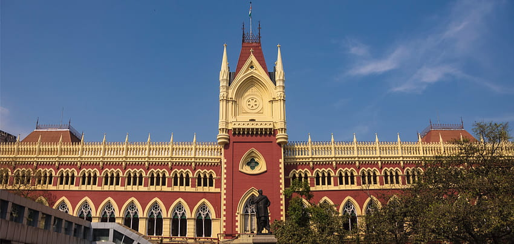

# Calcutta.js NPM Package



## Introduction

Welcome to the **Calcutta.js** NPM package! This package provides you with a glimpse into the rich history of Calcutta (now known as Kolkata), along with a simple greeting function. Whether you're a history enthusiast, a curious learner, or just someone who wants to send greetings to Calcutta, this package has something for you.

## Installation

To install the **Calcutta.js** package, you can use npm:

```bash
npm install calcutta
```

## Usage

### Greetings

Use the `greetings` function to send a greeting to Calcutta from your city:

```javascript
const calcutta = require('calcutta');

const greeting = calcutta.greetings('Your City type here');
console.log(greeting); // Output: Hello Calcutta, I am from Your City
```

### Short History

Retrieve a brief history of Calcutta using the `getShortHistory` function:

```javascript
const calcutta = require('calcutta');

const history = calcutta.getShortHistory();
console.log(history); // Output: (A brief history of Calcutta will be printed)
```

## History of Calcutta

Calcutta (now Kolkata) has a fascinating history that spans centuries. It has evolved from an ancient settlement to a vibrant cultural and economic hub. Here are some key highlights:

- **Early History:** The region's history dates back to ancient times, with evidence of human settlements. It was part of various dynasties including the Mauryans, Guptas, and Palas.

- **Colonial Era:** The English East India Company established a trading post in 1690, which grew into a major colonial settlement due to its strategic location.

- **Capital of British India:** Kolkata became the capital of British India in 1772 and thrived as a center of administration, commerce, and culture.

- **Cultural and Intellectual Hub:** The 19th and early 20th centuries marked Kolkata as a center of cultural and intellectual activity. Renowned figures like Rabindranath Tagore and Swami Vivekananda made significant contributions.

- **Struggle for Independence:** Kolkata played a vital role in India's struggle for independence, witnessing key events like the Bengal Partition and Mahatma Gandhi's Salt March.

- **Post-Independence Era:** After independence in 1947, Kolkata remained culturally significant but faced economic and infrastructural challenges.

- **Renaming and Modern Kolkata:** The city's name changed to Kolkata in 2001. Efforts continue to revitalize its economy and infrastructure, keeping it a cultural and educational powerhouse.

## Package Details

- **Name:** calcutta
- **Version:** 1.0.0
- **Description:** A package to explore the history of Calcutta and send greetings to the city.
- **Author:** SUBHAJIT CHAKRABORTY
- **License:** ISC

## Contribution

If you'd like to contribute to this package or report any issues, feel free to visit the [GitHub repository](https://github.com/drsubhajitchakraborty/calcutta).

## License

This package is available under the ISC License. See the [LICENSE](LICENSE) file for more details.

---


Thank you for using the **calcutta** npm package. We hope it allows you to explore the rich culture and heritage of this historic city! If you have any questions or feedback, don't hesitate to reach out.

Contributor: SUBHAJIT CHAKRABORTY